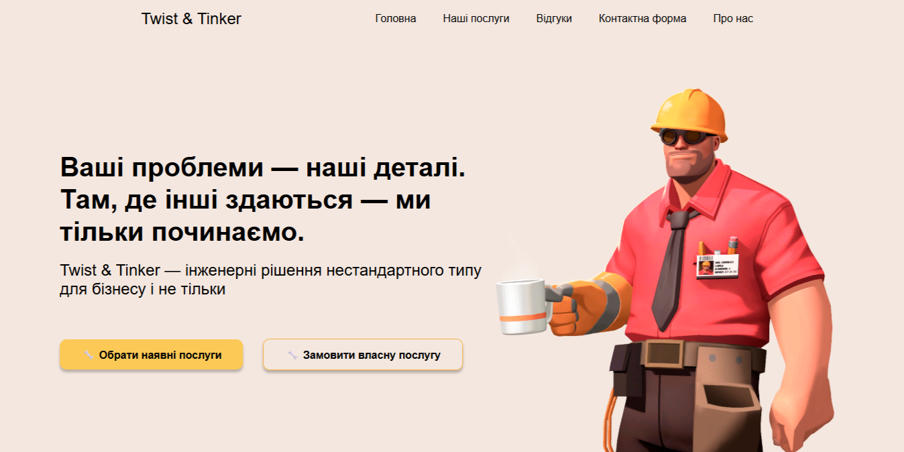

# Twist & Tinker 

Responsive landing page for a fictional consulting company featuring a unique brand identity, humorous copywriting, and modern front-end design.

[Live Demo](https://maxidium.github.io/twist-tinker-website/) | [Figma](https://www.figma.com/design/bdxOt4JUwOcBweu7yMlrhp/Twist---Tinker?node-id=0-1&t=vwEWrnbHoU0LsEIT-1)

## Features
- Creative fictional brand identity
- Responsive layout
- Semantic HTML5 markup
- CSS animations and transitions
- Interactive navigation

## Technologies
- HTML5
- CSS3
- JavaScript

## Tools
- Figma
- Visual Studio Code
